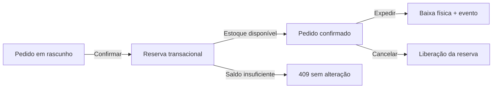

# StockFlow API

API REST de estoque e pedidos construída para demonstrar backend de produção: regras de negócio, concorrência, segurança, banco relacional, documentação e observabilidade.

> Projeto de portfólio de **Ronael Moura / Ronas Tech**. Os dados de demonstração são fictícios.

## Por que este projeto chama atenção

Não é apenas um CRUD. O StockFlow trata problemas comuns de sistemas reais:

- reserva de estoque dentro de transações MySQL;
- proteção contra pedidos duplicados com `Idempotency-Key`;
- concorrência otimista em movimentações de estoque;
- máquina de estados para impedir transições inválidas;
- ledger imutável de movimentações e trilha de auditoria;
- Outbox Pattern para eventos confiáveis;
- autenticação com access token curto e rotação de refresh token;
- autorização por papéis: `ADMIN`, `MANAGER`, `OPERATOR` e `VIEWER`;
- documentação OpenAPI interativa com Scalar;
- logs estruturados e rastreamento por `x-request-id`.

## Stack

Node.js 22, TypeScript, Express 5, MySQL 8, Zod, JWT, bcrypt, Pino, Scalar, Vitest e Docker.

## Fluxo principal



Cada mudança crítica grava, na mesma transação:

1. o novo estado do pedido ou estoque;
2. o movimento de inventário;
3. o evento de auditoria;
4. o evento pendente da Outbox.

Mais detalhes em [Decisões de arquitetura](docs/ARCHITECTURE.md).

## Executando com Docker

```bash
cp .env.example .env
docker compose up --build
```

Acesse:

- API: `http://localhost:3333`
- documentação: `http://localhost:3333/docs`
- especificação: `http://localhost:3333/openapi.json`

Credenciais locais do seed:

```text
admin@stockflow.dev
StockFlow@2026
```

## Executando sem Docker

Com um MySQL 8 disponível:

```bash
npm install
cp .env.example .env
npm run db:migrate
npm run db:seed
npm run dev
```

## Scripts que demonstram engenharia

| Script | Objetivo |
|---|---|
| `npm run quality` | Executa tipos, lint, testes e validação OpenAPI |
| `npm run demo:scenario` | Cria, confirma e expede um pedido pela API |
| `npm run routes:audit` | Exibe o catálogo público de operações |
| `npm run openapi:validate` | Valida o contrato e detecta rotas não documentadas |
| `npm run outbox:drain` | Processa eventos transacionais pendentes |
| `npm run db:reset` | Recria apenas bancos cujo nome começa com `stockflow` |
| `npm run test:coverage` | Gera relatório de cobertura das regras de negócio |

## Exemplo de pedido idempotente

```bash
curl -X POST http://localhost:3333/api/v1/orders \
  -H "Authorization: Bearer SEU_TOKEN" \
  -H "Idempotency-Key: checkout-2026-0001" \
  -H "Content-Type: application/json" \
  -d '{
    "customerName": "Ana Souza",
    "customerEmail": "ana@example.com",
    "items": [{
      "productId": "30000000-0000-4000-8000-000000000001",
      "warehouseId": "20000000-0000-4000-8000-000000000001",
      "quantity": 2
    }]
  }'
```

Repetir a chamada com a mesma chave retorna o recurso original em vez de criar outro pedido.

## Estrutura

```text
src/
├── config/          variáveis validadas
├── lib/             banco, erros, auditoria e outbox
├── middlewares/     autenticação, autorização e request context
├── modules/         auth, produtos, estoque, pedidos e dashboard
├── openapi.ts       contrato da API
├── app.ts           composição HTTP
└── server.ts        ciclo de vida do processo
```

## Segurança

Consulte [SECURITY.md](SECURITY.md). Nunca reutilize as credenciais ou a chave JWT de desenvolvimento em produção.

## Autor

Desenvolvido por [Ronael Moura](https://github.com/ronaelmoura) — criador da [Ronas Tech](https://www.ronastech.com.br/).

## Estudo técnico: reservar estoque ao confirmar um pedido

**Contexto.** Dois pedidos podem disputar o mesmo saldo disponível. Consultar o saldo e alterá-lo em operações independentes deixa espaço para decisões baseadas em dados desatualizados.

**Decisão implementada.** A [rota de confirmação](src/modules/orders/order.routes.ts) usa uma transação e consulta o estoque com `SELECT ... FOR UPDATE`. Calcula a disponibilidade como `quantity - reserved`; saldo insuficiente gera `409 INSUFFICIENT_STOCK`. A reserva, o movimento, a atualização do pedido, a auditoria e a Outbox são escritos dentro da transação. A expedição é uma etapa separada da reserva.

**Alternativas para comparação.** Baixar o estoque físico na criação simplificaria o fluxo, mas misturaria intenção de compra com expedição. Uma leitura sem bloqueio exigiria outra estratégia de controle concorrente. Essas alternativas explicam os compromissos do desenho, não uma decisão histórica de uma equipe.

**Evidência e reprodução.** Consulte as [decisões de arquitetura](docs/ARCHITECTURE.md), as [regras testadas](tests/order.rules.test.ts) e o [cenário demonstrativo](scripts/demo-scenario.ts). Com ambiente local e banco configurados, `npm run demo:scenario` executa o fluxo demonstrativo. Os testes de regras não comprovam, por si só, concorrência real em MySQL; a revisão documental não executou um teste de carga.

**Limite.** Bloqueios têm custo de contenção. Carga concorrente, deadlocks, retentativas e comportamento do consumidor da Outbox precisam de validação própria antes de uso crítico. Não há resultados de desempenho comercial declarados neste case.
