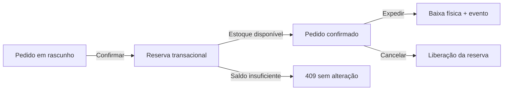

# StockFlow API

API REST de estoque e pedidos construída para explorar problemas de backend que aparecem em sistemas reais: regras de negócio, concorrência, consistência, segurança e observabilidade.

O foco não é CRUD. O projeto demonstra como proteger operações críticas quando múltiplas ações podem acontecer simultaneamente.

## O que este projeto demonstra

- Transações para operações críticas de estoque
- Controle de concorrência com `SELECT ... FOR UPDATE`
- Idempotência com `Idempotency-Key`
- Máquina de estados para pedidos
- Ledger imutável e Outbox Pattern
- RBAC e autenticação com rotação de refresh token
- Validação de entrada com Zod
- Logs estruturados e `x-request-id`
- Contrato OpenAPI e testes automatizados

## Problema técnico central

Dois pedidos podem disputar o mesmo saldo disponível. Uma leitura do estoque seguida de uma atualização independente pode tomar decisões com dados desatualizados.

Na confirmação do pedido, o StockFlow executa uma transação e bloqueia a linha de estoque durante a operação:

```text
Pedido em rascunho
      │
      ▼
Reserva transacional
   │         │
   │         └── saldo insuficiente → 409
   ▼
Pedido confirmado
   │
   ├── movimento de inventário
   ├── auditoria
   └── evento Outbox
```

A expedição é tratada como uma etapa separada da reserva.

## Decisão de engenharia

A rota de confirmação usa `SELECT ... FOR UPDATE` para proteger o estoque durante a transação. A disponibilidade é calculada como:

```text
quantidade disponível = quantidade - reservado
```

Se o saldo for insuficiente, a operação retorna `409 INSUFFICIENT_STOCK` sem confirmar o pedido.

A reserva, o movimento, a atualização do pedido, a auditoria e o evento Outbox são gravados dentro da mesma transação.

### Por que não um CRUD simples?

Porque o problema principal não é cadastrar produtos. É manter invariantes do domínio quando operações concorrentes disputam o mesmo recurso.

## Idempotência

Operações que podem ser repetidas aceitam `Idempotency-Key`.

```http
Idempotency-Key: checkout-2026-0001
```

Repetir uma solicitação com a mesma chave retorna o recurso original em vez de criar outro pedido.

Exemplo:

```bash
curl -X POST http://localhost:3333/api/v1/orders \
  -H "Authorization: Bearer SEU_TOKEN" \
  -H "Idempotency-Key: checkout-2026-0001" \
  -H "Content-Type: application/json" \
  -d '{
    "customerName": "Ana Souza",
    "customerEmail": "ana@example.com",
    "items": [{
      "productId": "30000000-0000-4000-8000-000000000001",
      "warehouseId": "20000000-0000-4000-8000-000000000001",
      "quantity": 2
    }]
  }'
```

## Stack

Node.js 22 · TypeScript · Express 5 · MySQL 8 · Zod · JWT · bcrypt · Pino · Scalar · Vitest · Docker

## Fluxo principal



## Controle de acesso

| Papel | Objetivo |
|---|---|
| ADMIN | Administração completa |
| MANAGER | Gestão operacional |
| OPERATOR | Operações de estoque e pedidos |
| VIEWER | Consulta |

## Documentação da API

O projeto expõe contrato OpenAPI e documentação interativa:

- `/docs`
- `/openapi.json`

Também possui validação automatizada para detectar operações não documentadas.

## Scripts que demonstram engenharia

| Script | Objetivo |
|---|---|
| `npm run quality` | Tipos, lint, testes e validação OpenAPI |
| `npm run demo:scenario` | Executa o fluxo de criação, confirmação e expedição |
| `npm run routes:audit` | Audita o catálogo público de operações |
| `npm run openapi:validate` | Valida o contrato da API |
| `npm run outbox:drain` | Processa eventos transacionais pendentes |
| `npm run test:coverage` | Gera cobertura das regras de negócio |

## Estrutura

```text
src/
├── config/          variáveis validadas
├── lib/             banco, erros, auditoria e outbox
├── middlewares/     autenticação, autorização e request context
├── modules/         auth, produtos, estoque, pedidos e dashboard
├── openapi.ts       contrato da API
├── app.ts           composição HTTP
└── server.ts        ciclo de vida do processo
```

## Executar com Docker

```bash
cp .env.example .env
docker compose up --build
```

Acesse:

- API: `http://localhost:3333`
- documentação: `http://localhost:3333/docs`
- OpenAPI: `http://localhost:3333/openapi.json`

## Executar sem Docker

Com MySQL 8 disponível:

```bash
npm install
cp .env.example .env
npm run db:migrate
npm run db:seed
npm run dev
```

## Segurança

- Access tokens de curta duração
- Rotação de refresh tokens
- RBAC
- Validação de entrada com Zod
- Senhas com bcrypt
- Logs estruturados
- Request ID para rastreabilidade

Consulte [SECURITY.md](SECURITY.md) para detalhes.

## Limites do case

Este projeto demonstra estratégias de consistência e confiabilidade, mas não declara escala ou desempenho comercial.

Os testes de regras não comprovam, sozinhos, concorrência real em MySQL. Carga concorrente, deadlocks, retentativas e comportamento do consumidor da Outbox exigem validação própria antes de uso crítico.

## Autor

**Ronael Moura — Desenvolvedor Full Stack**

- [GitHub](https://github.com/ronaelmoura)
- [Portfólio](https://ronaelmoura.github.io/portfolio-ronael-moura/)
- [Ronas Tech](https://www.ronastech.com.br/)

---

**StockFlow API** · backend engineering case · TypeScript + Node.js + MySQL
